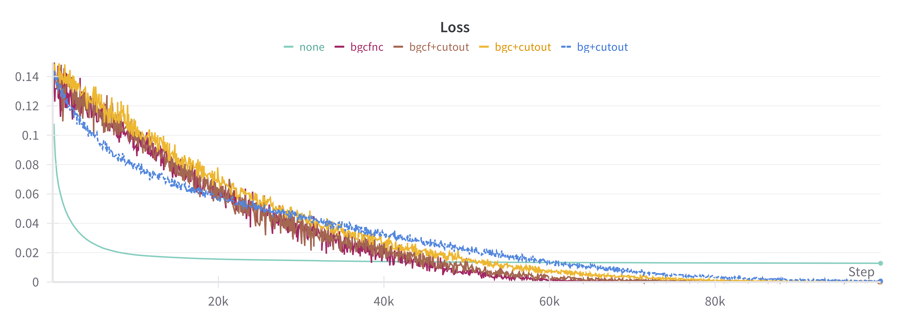

# Minimal code aiming to reproduce E-LatentLPIPS

This is an unofficial implementation of E-LatentLPIPS in Diffusion2GAN. 

## Quick Start
```python
import torch
from elatentlpips import ELatentLPIPS

latent0 = torch.randn(1, 4, 64, 64).to("cuda") # Encoded image1
latent1 = torch.randn(1, 4, 64, 64).to("cuda") # Encoded image2
elatentlpips = ELatentLPIPS(pretrained_latent_lpips_path="/path/to/model.safetensors", aug_type="bgcfnc").to("cuda")
distance = elatentlpips(latent0, latent1)

```

## Installation
Quick Use:
```bash
pip install -e .
```
or
```bash
pip install git+
```
Training:
```bash
pip install -e ".[train]"
```
Download the pretrained model from [here](https://huggingface.co/alex4727/E-LatentLPIPS/tree/main) and put the appropriate path in the initialization code.

## Overfitting experiment results




- In our experiment, initial loss scales (0.1~0.3) were smaller compared to the original paper (0.5+). 
- Toy (reconstruction) experiment results got better as we increased the type of applied augmentations (bgcfnc > bgcf_cutout > bgc_cutout > bg_cutout >> none).
- Careful selection of augmentations would be important to avoid undesired artifacts in actual model training. 

## Features
- Pretrained models for SD 1.5 VAE encoder and LPIPS-like loss calculation using *elatentlpips* package.
- Training code for Latent VGG Network using ImageNet.
- Training code for LPIPS-style linear calibration using BAPPS.
- Training code for toy experiments (overfitting) using 1-8 images.

## Performances
- ImageNet Validation Scores for Latent VGG Network (SD 1.5 VAE encoder)

<div align="center">

| Top-1 Acc. |  VGG16  | VGG16-bn | VGG16-gn (reproduced) |
|:-------------------:|:-------:|:--------:|:---------:|
| Pixels          |  71.59  |  73.36   |    -    |
| Latent          |  64.25  |  68.26   | **72.63200** |

</div>

- BAPPS 2AFC Scores 

<div align="center">

| **Perceptual Metric**     | **BAPPS 2AFC Traditional** | **BAPPS 2AFC CNN** | **BAPPS 2AFC REAL** |
|---------------------------|----------------------------|--------------------|--------------------|
| LPIPS                     | 73.36                      | 82.20              | 63.23              |
| LatentLPIPS               | 74.29                      | 81.99              | 63.21              |
| LatentLPIPS (reproduced)  | **75.24**                  | **82.33**          | **63.40**          |

</div>

## Some design choices 
- While the original E-LatentLPIPS uses a batch norm variant of VGG16, we have used GroupNorm for the ease of distributed training.
- Not many details were provided in the paper for the latent VGG network other than 3 removed maxpooling layers. We manually modified the VGG16 layers to reflect this.

## Notes
- Inputs to VAE are expected to be scaled properly (check [utils.py](utils.py) for how they should be scaled).
- The code uses mixed precision by default (and fp16 for VAE except for FLUX which uses bf16). 
- The Latent VGG network was trained on 8xA6000 for ~ 5 days.
- Linear layers for LPIPS were trained for ~ 10 hours on 4xA6000.
- Toy experiments take about 40 minutes on a single A6000.
- While the code should handle other variants of encoders as well (e.g., SDXL, SD3, and FLUX), we only tested with SD 1.5 due to resource constraints. 
- We welcome results for other VAE variants as well! (You can just change the vae_type argument)
- Check sample_scripts.sh for how to run the code.

## Credits
- Augmentation code is brought from the [StyleGAN2-ADA repo](https://github.com/NVlabs/stylegan2-ada-pytorch). 
- Some parts of the model code are modified from the [original LPIPS repo](https://github.com/richzhang/PerceptualSimilarity).
- Huge thanks to the authors of [Diffusion2GAN](https://mingukkang.github.io/Diffusion2GAN/) for the amazing work! 

## Citation
If you find this code useful, please leave appropriate attribution/citation to our code as well as the original paper:
```
@inproceedings{kang2024diffusion2gan,
  author    = {Kang, Minguk and Zhang, Richard and Barnes, Connelly and Paris, Sylvain and Kwak, Suha and Park, Jaesik and Shechtman, Eli and Zhu, Jun-Yan and Park, Taesung},
  title     = {{Distilling Diffusion Models into Conditional GANs}},
  booktitle = {European Conference on Computer Vision (ECCV)},
  year      = {2024},
}
```
